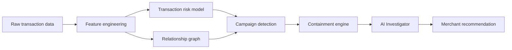
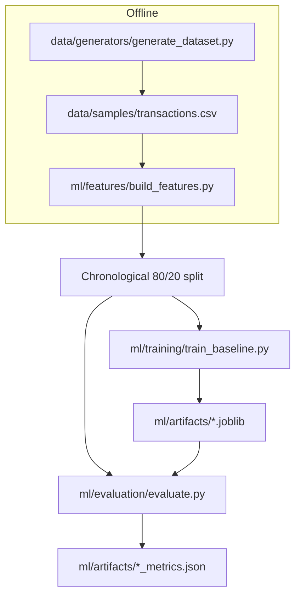
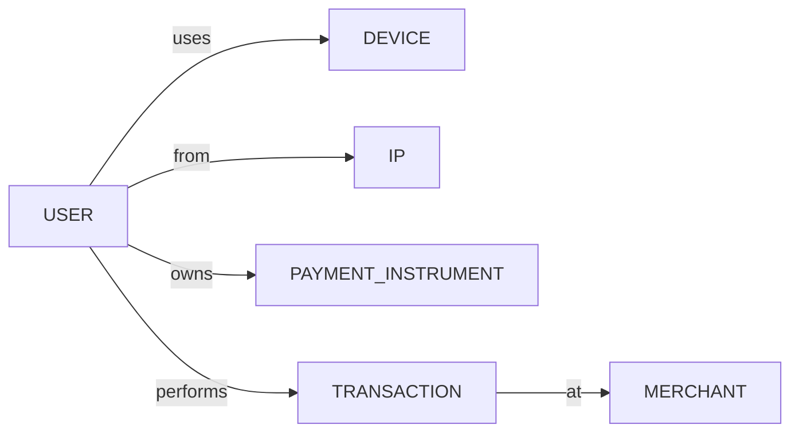
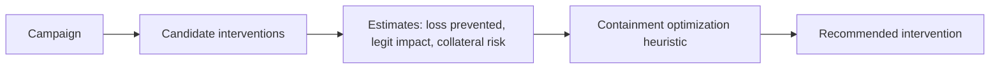
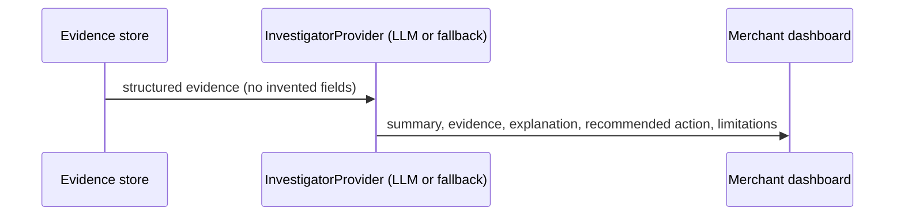

# RiskLattice Architecture

> Status: architecture document tracks the planned target system and the
> **current** implementation state. As of **Phase 2**, the implemented layers
> are: dataset generation, schema, feature engineering, a transaction-level ML
> baseline, and held-out evaluation. Graph / campaign / containment /
> investigator / API / frontend layers are designed below but not yet built.

---

## 1. System architecture

Design principle (per the project spec):

> The ML/statistical/graph layers generate evidence. The AI layer explains,
> investigates, summarizes, and recommends based on structured evidence. The
> AI layer must not invent evidence.

## 2. Data flow

## 3. Feature engineering (implemented, Phase 2)

Features are **past-only**: each transaction's aggregate/velocity values are
computed strictly from transactions that occurred before it. The builder sorts
transactions chronologically and reads a running per-entity state *before*
registering the current transaction.

| Category | Examples |
|---|---|
| Transaction | amount, log_amount, hour, day_of_week, is_weekend, one-hot payment/status |
| User | transaction/success/failed/refund counts & rates before, time since previous |
| Device | transaction count before, unique users before |
| IP | transaction count before, unique users before |
| Payment instrument | transaction count before, unique users before |
| Velocity | 5m / 1h / 24h activity before, for user/device/IP/instrument |

**Leakage guards:** `is_fraud`, `fraud_campaign_id`, and `scenario` are never
included in the model matrix; `ensure_no_ground_truth()` raises if they appear.
Time-based (not random) splitting guarantees no future information in
historical aggregates. Preprocessing (imputer + scaler) is fit on training data
only.

## 4. Baseline model (implemented, Phase 2)

The baseline is **transaction-level only**:

- Logistic Regression (primary) with `class_weight="balanced"`.
- Random Forest (comparison) with a defensible default config.
- Threshold chosen on out-of-fold **training** predictions (F1-maximizing);
  the held-out test set never influences threshold selection or fitting.

**Current limitation (explicit):** this baseline does **not** yet understand
fraud campaigns, graph relationships, connected components, coordinated
entities, or containment. Those are distinct, later phases. Phase 9 will
measure whether network-aware detection and containment improve decision
quality over this baseline — the results may show no improvement, and that will
be reported honestly.

## 5. Graph model (planned, Phase 3)

Edges retain relationship_type, first_seen, last_seen, transaction_count.
Graph features feed campaign detection.

## 6. Campaign detection (planned, Phase 4)

Suspicious transaction scores + shared entities + temporal proximity +
relationship density produce candidate campaigns with a transparent 0–100
score.

## 7. Containment flow (planned, Phase 5)

Containment is a **heuristic** (not claimed optimal). It searches small action
sets maximizing campaign coverage while minimizing collateral customer cost.

## 8. AI investigation flow (planned, Phase 6)

InvestigatorProvider abstraction consumes structured evidence only:
campaign summary, risk score, graph relationships, transaction statistics,
containment candidates, historical context. Deterministic template fallback
keeps the app functional without an LLM API key.

## 9. Decision & audit model (planned)

Decisions: `ALLOW` / `REVIEW` / `BLOCK`. All actions are `SIMULATED` /
`TEST MODE` until explicit merchant approval. Every action records action_id,
timestamp, actor, reason, evidence, target, previous_state, new_state,
approval_status, forming an auditable trail.

## 10. Security posture

- Synthetic IDs only (USER_*/DEV_*/IP_*/PI_*); never real card numbers, CVV,
  credentials, or tokens.
- Offense-capable functionality is out of scope.
- Demo cost model is explicitly labeled as assumptions, not Razorpay economics.