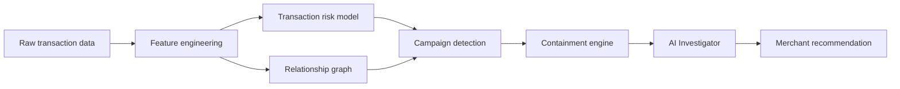
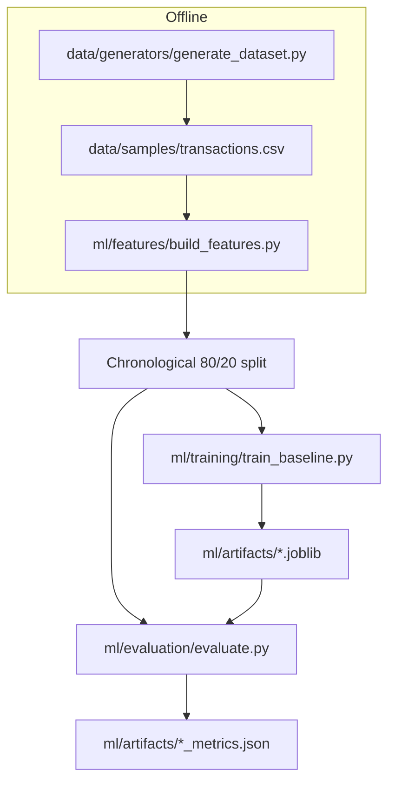
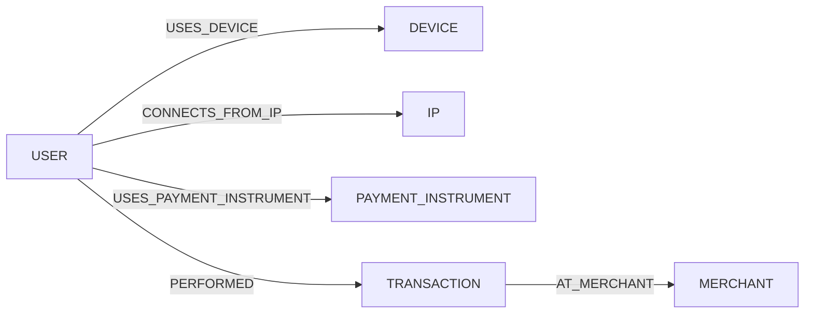
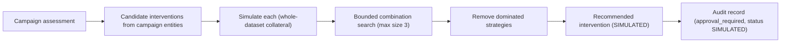
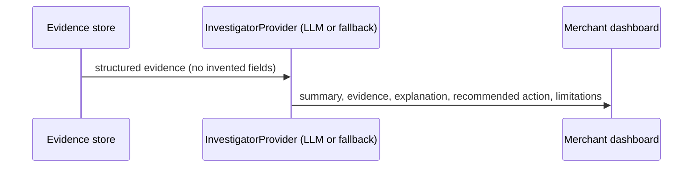

# RiskLattice Architecture

> Status: architecture document tracks the planned target system and the
> **current** implementation state. As of **Phase 5**, the implemented layers
> are: dataset generation, schema, feature engineering, a transaction-level ML
> baseline, held-out evaluation, the relationship graph engine, campaign
> intelligence with transparent risk scoring, and a simulated containment
> optimizer. AI investigator / API / frontend layers are designed below but
> not yet built.

---

## 1. System architecture

Design principle (per the project spec):

> The ML/statistical/graph layers generate evidence. The AI layer explains,
> investigates, summarizes, and recommends based on structured evidence. The
> AI layer must not invent evidence.

## 2. Data flow

## 3. Feature engineering (implemented, Phase 2)

Features are **past-only**: each transaction's aggregate/velocity values are
computed strictly from transactions that occurred before it. The builder sorts
transactions chronologically and reads a running per-entity state *before*
registering the current transaction.

| Category | Examples |
|---|---|
| Transaction | amount, log_amount, hour, day_of_week, is_weekend, one-hot payment/status |
| User | transaction/success/failed/refund counts & rates before, time since previous |
| Device | transaction count before, unique users before |
| IP | transaction count before, unique users before |
| Payment instrument | transaction count before, unique users before |
| Velocity | 5m / 1h / 24h activity before, for user/device/IP/instrument |

**Leakage guards:** `is_fraud`, `fraud_campaign_id`, and `scenario` are never
included in the model matrix; `ensure_no_ground_truth()` raises if they appear.
Time-based (not random) splitting guarantees no future information in
historical aggregates. Preprocessing (imputer + scaler) is fit on training data
only.

## 4. Baseline model (implemented, Phase 2)

The baseline is **transaction-level only**:

- Logistic Regression (primary) with `class_weight="balanced"`.
- Random Forest (comparison) with a defensible default config.
- Threshold chosen on out-of-fold **training** predictions (F1-maximizing);
  the held-out test set never influences threshold selection or fitting.

**Current limitation (explicit):** this baseline does **not** yet understand
fraud campaigns, graph relationships, connected components, coordinated
entities, or containment. Those are distinct, later phases. Phase 9 will
measure whether network-aware detection and containment improve decision
quality over this baseline — the results may show no improvement, and that will
be reported honestly.

## 5. Graph model (implemented, Phase 3)

### Node & edge model

Every node stores `node_id` and `node_type`. Transaction nodes additionally
store `timestamp`, `amount`, `status`. Repeated relationships between the same
pair are **aggregated** into one edge carrying `relationship_type`,
`first_seen`, `last_seen`, and `transaction_count`, so temporal awareness is
retained (distinguishing long-lived normal relationships from new dense
bursts).

### Temporal relationship model

Each edge's `first_seen`/`last_seen` come from the transaction timestamps.
Window helpers (`transactions_in_window` for 5m/1h/24h) are **past-only**:
they consider only transactions at or before the reference timestamp and never
use future information — consistent with the Phase-2 no-future-leakage rule.

### Graph evidence model

`extract_graph_evidence(transaction_id)` returns structured evidence only:
`shared_device_users`, `shared_ip_users`, `shared_payment_users`,
`relationship_counts`, and `temporal_density` (5m/1h/24h windows). No
natural-language explanation is generated at this layer; the AI investigator
(Phase 6) will consume this structured evidence.

### Why shared IP != fraud, shared device != fraud, high degree != fraud

The graph is **evidence, not verdict**. A shared IP in a university or office
produces high `IP` degree and many `shared_ip_users` — the graph records this
as high connectivity, and the campaign detector treats it as a *signal to
combine with other signals* (risk score, temporal density, entity sharing),
never as proof of fraud. Tests enforce that a 100-user shared IP or shared
device graph carries **no** fraud label on any node.

### Candidate campaigns (Phase 3 prelude)

`campaign_detector.find_campaign_candidates` groups suspicious transactions
that share an entity and fall within a temporal window. Suspiciousness comes
from the Phase-2 model probability (or a documented structural fallback when no
model exists). Ground-truth fields are never used for detection.

## 6. Campaign detection (Phase 4 — implemented)

The final detector builds on Phase 3 candidate campaigns and adds a transparent,
deterministic 0–100 campaign risk score.

### Risk dimensions (each normalized 0..1)

| Dimension | Formula (documented heuristic) |
|---|---|
| transaction_risk | 0.45·mean(proba) + 0.35·high_ratio + 0.20·p90(proba) |
| relationship_risk | 0.35·density + 0.35·log-scaled fanout + 0.30·multi_signal |
| temporal_risk | clip(tx_per_hour / 120, 0, 1) |
| concentration_risk | mean of log-scaled per-entity (users, tx fan-out) |
| behavioral_risk | 0.40·refund_ratio + 0.30·failed_ratio + 0.30·amount_top_share |

### Campaign score formula ("transparent heuristic campaign score")

    campaign_score =
        0.35·transaction_risk
      + 0.25·relationship_risk
      + 0.20·temporal_risk
      + 0.10·concentration_risk
      + 0.10·behavioral_risk
    → × 100 → 0..100

These weights are a documented starting point, **not** statistically optimal.

### Risk levels (configurable thresholds)

| 0–29 LOW | 30–59 MEDIUM | 60–79 HIGH | 80–100 CRITICAL |

### Risk vs confidence

- **Risk** = "how dangerous does this campaign appear?" (the weighted score).
- **Confidence** = "how strong is the supporting evidence?" — separate, driven
  by elevated-signal fraction, entity-type completeness, per-transaction risk
  agreement (low dispersion), graph evidence strength, and temporal richness.

### Evidence model

Every assessment carries structured `EvidenceItem` objects:
`shared_device`, `shared_ip`, `shared_payment_instrument`, `temporal_burst`,
`high_transaction_risk`, `high_velocity`, `refund_pattern`,
`failed_payment_pattern`, `entity_concentration`. Each references **real**
entities / supporting transactions only — no invented identifiers.

### Ground-truth evaluation methodology

Ground-truth labels (`is_fraud`, `fraud_campaign_id`) are consumed in
evaluation only. Documented definitions:

- **fraud_transaction_coverage** = fraud tx in ≥HIGH campaigns / all fraud tx
- **legitimate_transaction_coverage** = legit tx in ≥HIGH campaigns / all legit tx
- **candidate_campaign_precision** = fraud tx in flagged set / flagged tx
- **campaign_recall** = ground-truth fraud campaigns with ≥1 covered tx / all
- **campaign_precision** = high-risk candidates containing ≥1 fraud tx / high-risk candidates

### False-negative analysis (diagnostic)

Phase-2 false negatives are checked for membership in high-risk campaigns after
scoring. This is reported as a measured number (it may be zero); the label is
never fed into detection or scoring.

## 7. Containment flow (implemented, Phase 5)

### Architecture

### Action types

`BLOCK_TRANSACTION`, `REVIEW_TRANSACTION`, `BLOCK_USER`, `REVIEW_USER`,
`RESTRICT_DEVICE`, `REVIEW_DEVICE`, `RESTRICT_PAYMENT_INSTRUMENT`,
`REVIEW_PAYMENT_INSTRUMENT`, `MONITOR_CAMPAIGN`, `NO_ACTION`. All are
SIMULATED / TEST-MODE; no real payment action is executed.

### Simulation model

`simulate_action` evaluates an action against the **entire** dataset (not just
the campaign): restricting `DEVICE_044` affects every transaction historically
associated with it, including legitimate ones outside the campaign.

- `fraud_containment_rate` = suspicious tx affected / suspicious tx in campaign
- `fraud_exposure_contained` = suspicious amount affected (exposure estimate;
  **not** "money recovered")
- `legitimate_impact_rate` = legit tx affected / all related legit tx
- `collateral_risk` = 0.40*legit_tx_norm + 0.25*legit_user_norm +
  0.20*unrelated_entity_norm + 0.15*legit_proportion → LOW/MEDIUM/HIGH

Ground-truth isolation: during optimization the fraud/legit split is derived
from Phase-2 risk scores (risk ≥ 0.5 = suspicious). Ground-truth labels are
consumed only by the dedicated `evaluate_strategy_ground_truth` helper.

### Optimization heuristic (documented, NOT claimed optimal)

1. Generate candidate actions from the campaign's own users/devices/payment
   instruments/high-risk transactions.
2. Rank actions by affected suspicious volume; keep top-K=10.
3. Evaluate singles, pairs, triples (bounded; max 3 actions).
4. Enforce constraints: max legit users (default 5), min fraud containment
   (default 0.70), max actions (default 3). If none pass → `NO_SAFE_ACTION`.
5. Remove dominated strategies (≥ containment and ≤ every impact/cost dim).

### Containment score (transparent heuristic)

    containment_score = fraud_containment_value
                        - 0.35*legit_impact_penalty
                        - 0.15*action_cost_penalty
                        - 0.20*collateral_penalty

### NO_SAFE_ACTION behavior

If no bounded strategy reaches the minimum fraud containment without exceeding
the legitimate-user cap, the system returns `NO_SAFE_ACTION` rather than
forcing a recommendation.

### Audit trail

Every recommendation records `decision_id`, `timestamp`, `campaign_id`,
candidate actions, selected strategy, constraints, risk score, evidence types,
reason, `approval_required`, and `execution_status: SIMULATED`.

## 8. AI investigation flow (planned, Phase 6)

InvestigatorProvider abstraction consumes structured evidence only:
campaign summary, risk score, graph relationships, transaction statistics,
containment candidates, historical context. Deterministic template fallback
keeps the app functional without an LLM API key.

## 9. Decision & audit model (planned)

Decisions: `ALLOW` / `REVIEW` / `BLOCK`. All actions are `SIMULATED` /
`TEST MODE` until explicit merchant approval. Every action records action_id,
timestamp, actor, reason, evidence, target, previous_state, new_state,
approval_status, forming an auditable trail.

## 10. Security posture

- Synthetic IDs only (USER_*/DEV_*/IP_*/PI_*); never real card numbers, CVV,
  credentials, or tokens.
- Offense-capable functionality is out of scope.
- Demo cost model is explicitly labeled as assumptions, not Razorpay economics.